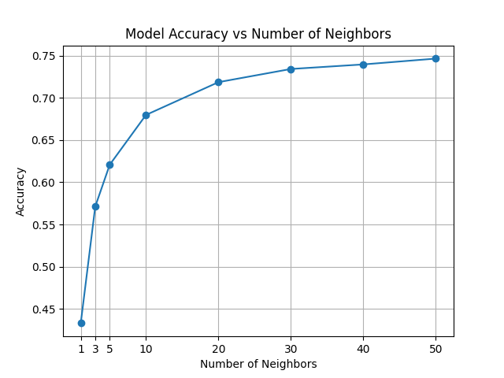

    

# MNIST Digit Recognition

Achieved 75% accuracy using a simple cosine similarity approach under 50 lines of code, with no training.
Each instance from the test set is compared with `num_neighbors` instances of each digit from the training set, and the digit with the highest sum of similarities is predicted. As we can see in the plot below, the accuracy increases with the number of neighbors.

    

